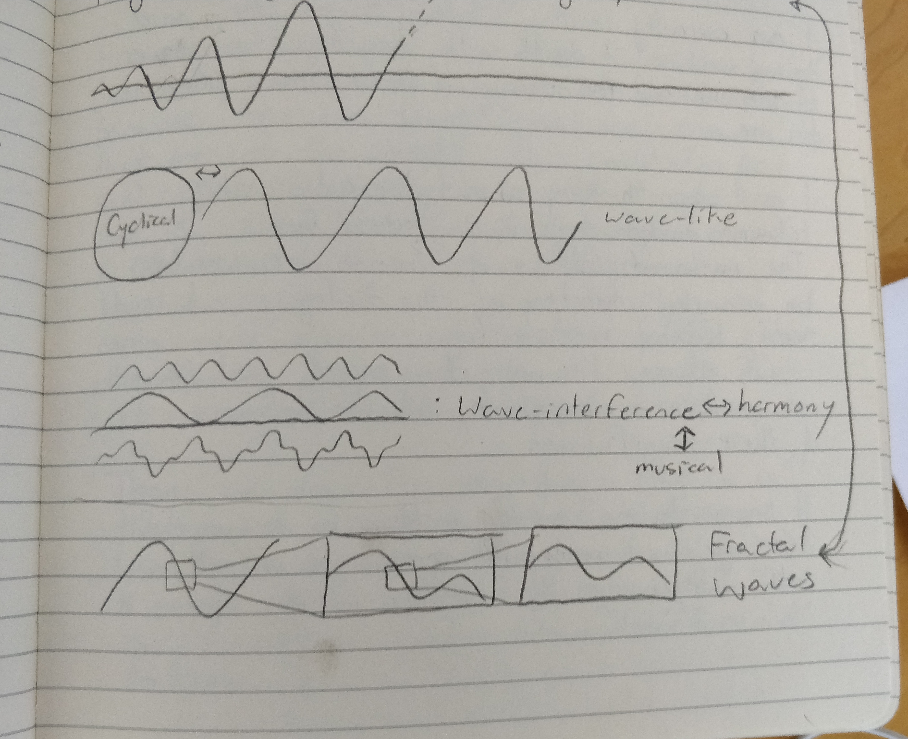
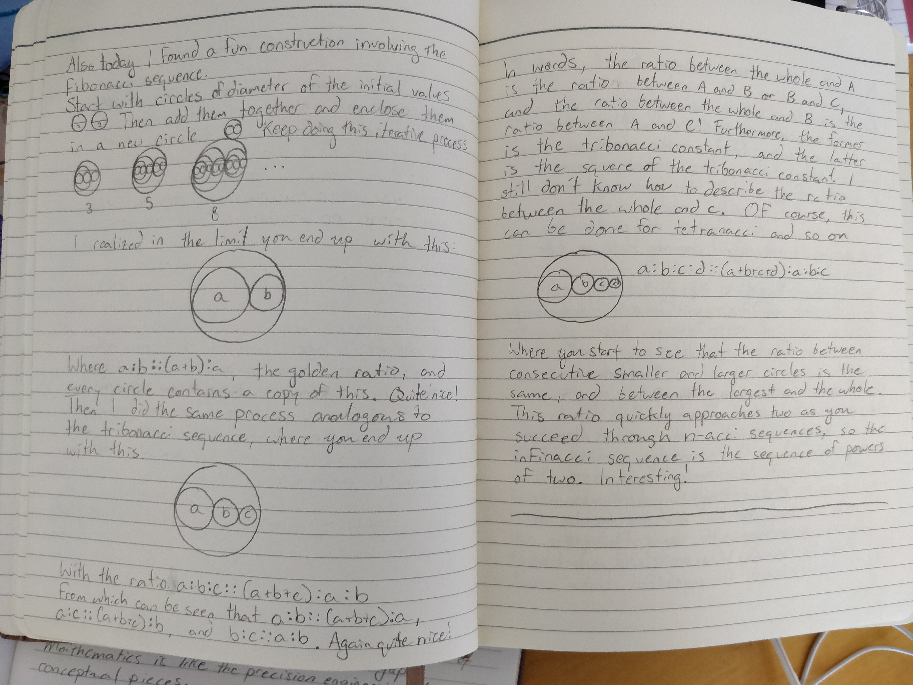
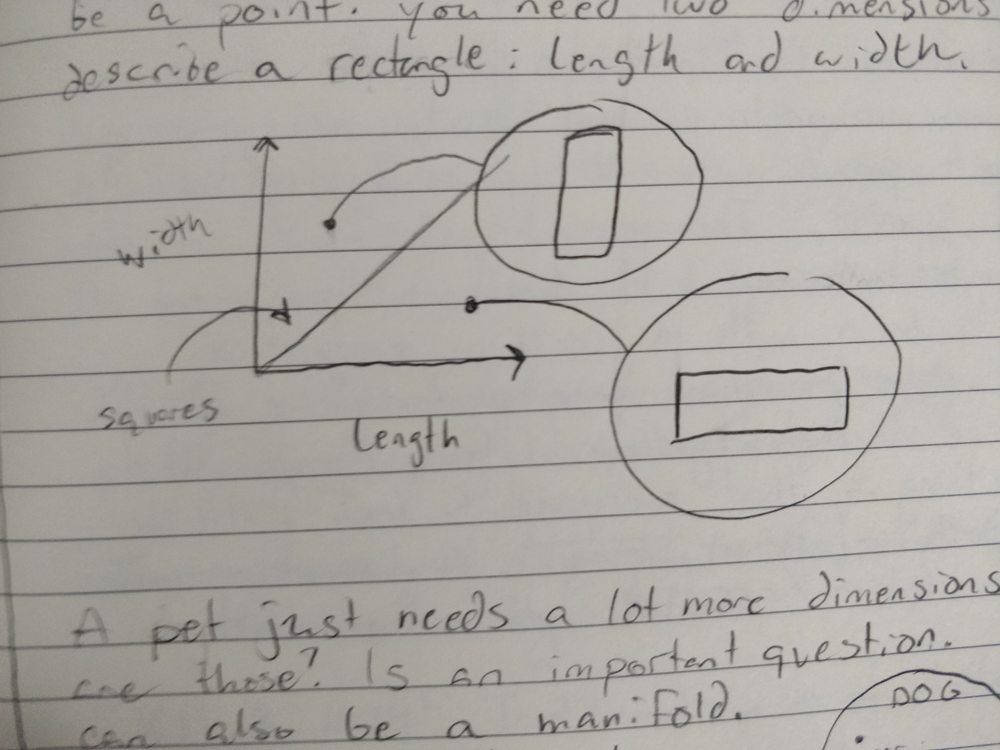
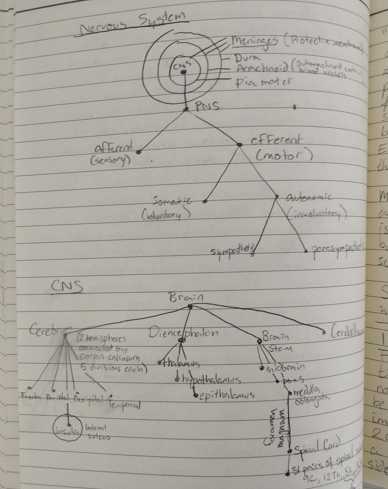
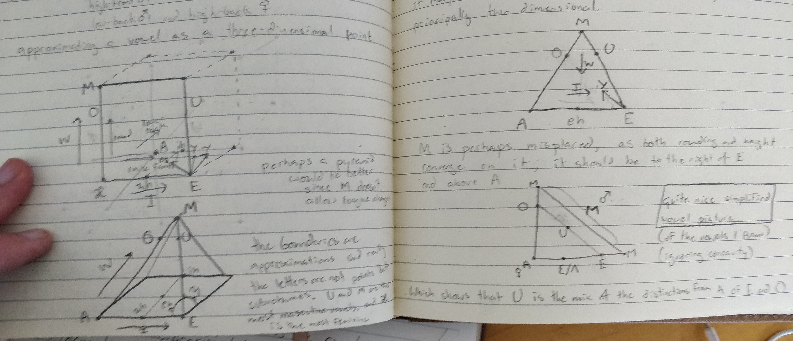
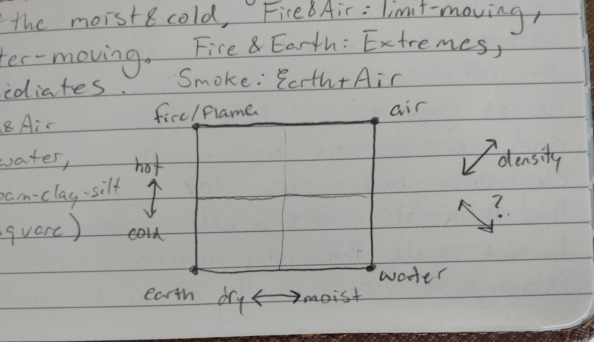

## Various pictures for my 3blue1brown internship application 

This is a selection of random graphical elements from my journals in no particular order. They are not meant to show any particularly detailed, skillful, or complete work, but rather only demonstrate that I understand the basic elements and reasoning of illustrative representation. Some of them also demonstrate that I know how to incorporate illustrations into a written work.

A diagram of a computer from when I was doing some idiosyncratic theorizing about computer science

A rough illustration of "political polarization" within "policy space"

Just some waves. Particularly, "fractal waves" as inspired by the Weierstrass function.

A neat representation of the fibonacci sequence, also showing its relation to the golden ratio. Similar representation for the tribonacci and tetranacci versions.

Rectangle space

Rough tree diagram of the nervous system and brain

An attempt at formulating a "vowel space"

My version of formulating Aristotle's theory of elements from On Generation and Corruption. Compare [Leibniz's (more ornamental) version](https://upload.wikimedia.org/wikipedia/commons/5/5c/Fotothek_df_tg_0005486_Mathematik_%5E_Kombinatorik.jpg)...
